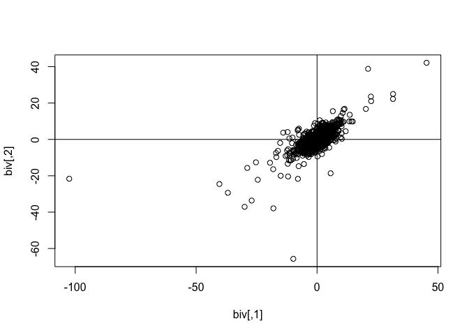

<!-- README.md is generated from README.Rmd. Please edit that file -->

# mvpd

<!-- badges: start -->
<!-- badges: end -->

The goal of mvpd is to …

## Installation

You can install the development version of mvpd from
[GitHub](https://github.com/) with:

``` r
# install.packages("devtools")
devtools::install_github("swihart/mvpd")
```

## Example

Generate 10 draws from a random bivariate subgaussian stable
distribution with alpha=1.71 and plot.

``` r
library(mvpd)
#> Loading required package: mvtnorm
#> Loading required package: stabledist
#> Loading required package: libstableR
#> Loading required package: cubature
#> Loading required package: matrixStats
## basic example code
biv <- rmvss(n=10, alpha=1.71, Q=matrix(c(10,7.5,7.5,10),2))
biv
#>             [,1]        [,2]
#>  [1,] 18.2017689 20.12074675
#>  [2,] -1.0589176  1.11396348
#>  [3,] -2.8641634 -2.77033525
#>  [4,] -3.5495674 -4.37285275
#>  [5,]  9.9699089  7.99701429
#>  [6,] -5.7958477  7.38852203
#>  [7,] -1.8223529  0.03409237
#>  [8,] -1.7672953 -4.95932758
#>  [9,]  5.4341818  2.22624407
#> [10,] -0.3898512  3.25858296
```


