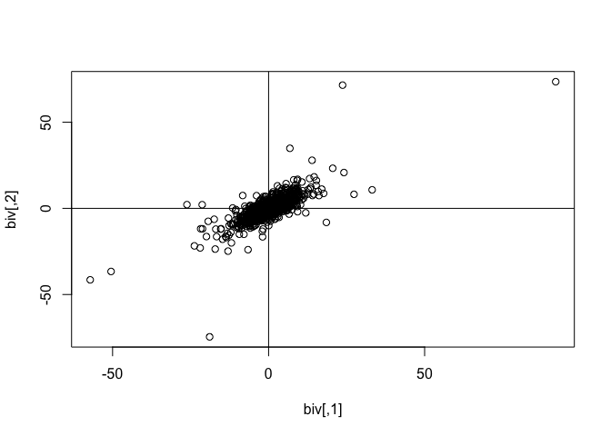

<!-- README.md is generated from README.Rmd. Please edit that file -->

# mvpd

<!-- badges: start -->
<!-- badges: end -->

The goal of mvpd is to …

## Installation

You can install the development version of mvpd from
[GitHub](https://github.com/) with:

``` r
# install.packages("devtools")
devtools::install_github("swihart/mvpd")
```

## Example

Generate 1000 draws from a random bivariate subgaussian stable
distribution with alpha=1.71 and plot.

``` r
library(mvpd)
#> Loading required package: mvtnorm
#> Loading required package: stabledist
#> Loading required package: libstableR
#> Loading required package: cubature
#> Loading required package: matrixStats
## basic example code
biv <- rmvss(n=1e3, alpha=1.71, Q=matrix(c(10,7.5,7.5,10),2))
head(biv)
#>            [,1]      [,2]
#> [1,]  2.8007853  1.551301
#> [2,]  7.3093794  6.471486
#> [3,] -0.8767313  1.430939
#> [4,] -2.6736874 -4.013020
#> [5,]  3.1114680  4.558173
#> [6,]  8.4333645  5.855828
plot(biv); abline(h=0,v=0)
```


