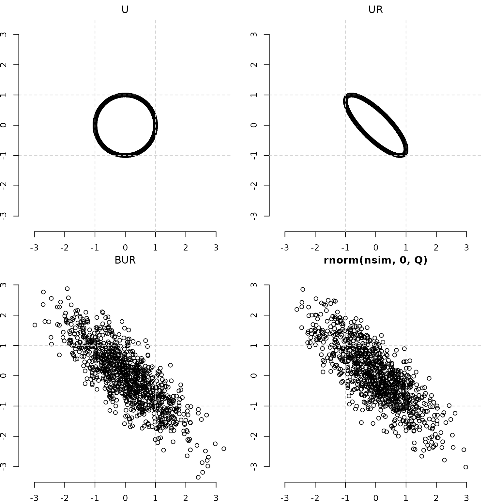

# Introduction and Primer

- Start with a unit circle U.
- Apply A and make an ellipse UA.  
- Scatter that ellipse by applying R to UA.  
- RUA is a Bivariate Normal.

Notes:

- U is a `n x 2` matrix containing n random draws from the uniform
  circle.
- UA is the result of the matrix multiplication between `n x 2` U and
  `2 x 2` A, the Cholesky decomposition of a `2x2` matrix Q.
  - Matrix A makes a circle (U) into an ellipse (UA)
  - Matrix A can be thought of as a “square root” of a matrix. A’A = Q.
- When R is a `n x n` matrix with a random sample of size `n` from a
  $\chi$(df=2) distribution on the diagonal (and 0 off-diagonal), RUA is
  the bivariate normal distribution G(0,Q) (`mvpd` uses the letter G to
  denote Gaussian).
- Changing the distribution in R changes the multivariate distribution
  of RUA . That’s what this package is all about!

You can change the order of application of A and R – check out [the
other intro](https://swihart.github.io/mvpd/articles/intro1.html).
