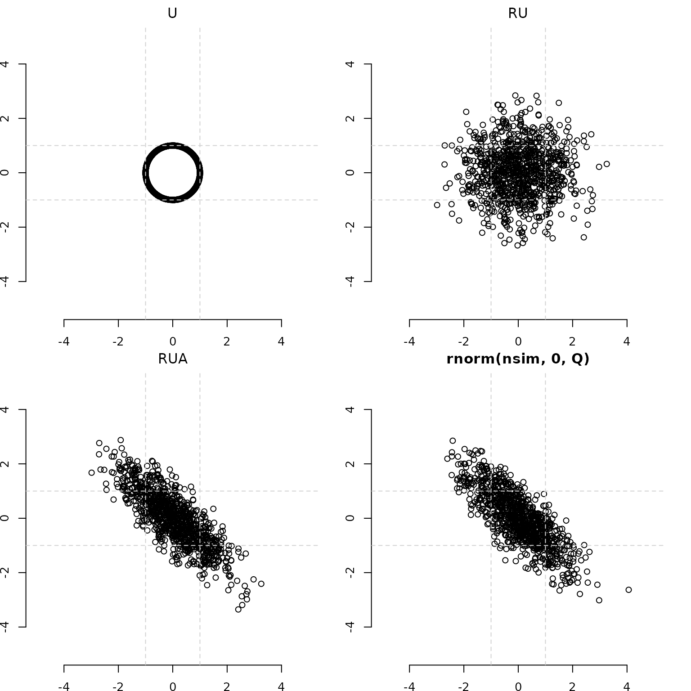

# Introduction and Primer II

- Start with a unit circle U.
- Scatter that ellipse by applying R to U.  
- Apply A and make an elliptical scatterplot RUA.
- RUA is a Bivariate Normal.

- U is a `n x 2` matrix containing n random draws from the uniform
  circle.
- When R $\sim \chi$(df=2) distribution, RU is a roughly spherical
  scatterplot
- RUA is the result of the matrix multiplication between `n x 2` RU and
  `2 x 2` A, the Cholesky decomposition of a `2x2` matrix Q.
  - A makes a circle (U) into an ellipse (UA)
  - A can be thought of as a “square root” of a matrix. A’A = Q.
- RUA is the bivariate normal distribution G(0,Q), Equivalently
- `mvpd` uses G for Gaussian
