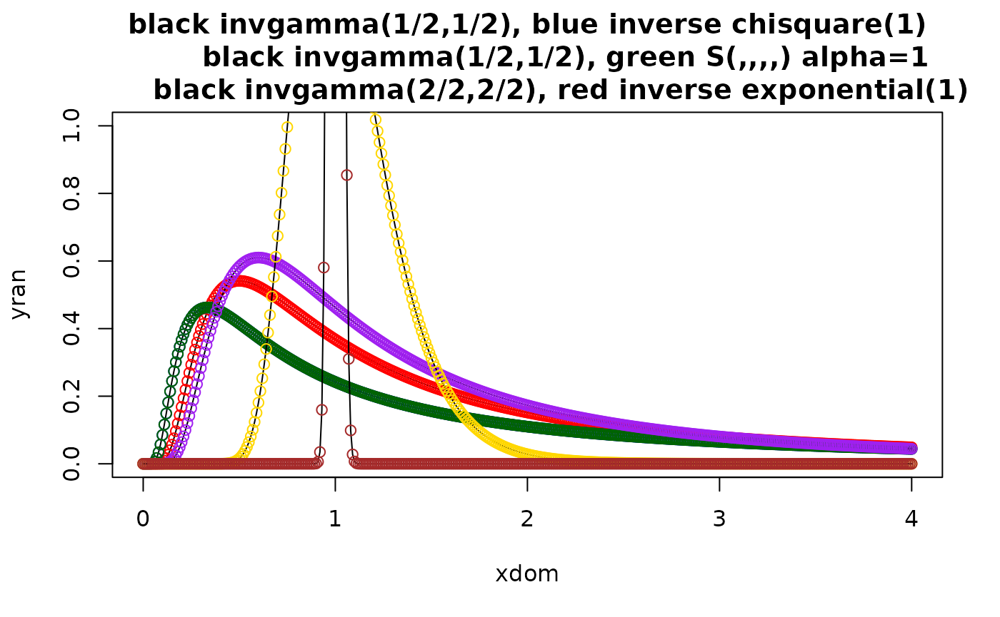

# Why do both the mvt and mvss have a mvcauchy special instance?

------------------------------------------------------------------------

**IN PROGRESS**

------------------------------------------------------------------------

``` r
library(mvpd)
```


