# (XY)^Z Part I

------------------------------------------------------------------------

**IN PROGRESS**

------------------------------------------------------------------------

I’m about 8 months late to the party, but a challenge problem from
3blue1brown caught my attention, as well as a call for intuitive
approaches to explaining the result.

> Here’s the challenge mode for all you math whizzes. Sample three
> numbers x, y, z uniformly at random in \[0, 1\], and compute (xy)^z.
> What distribution describes this result?
>
> Answer: It’s uniform!
>
> I know how to prove it, but haven’t yet found the “aha” style
> explanation where it feels expected or visualizable. If any of you
> have one, please send it my way and I’ll strongly consider making a
> video on it.
>
> – Grant Sanderson of 3blue1brown, 2024-09-10

While this relation and proofs of the result have been around for a
while, as shown in this [Math SE post from
2012](https://math.stackexchange.com/q/261783/180716), the renewed
notoriety is how it caught my attention – and even then 8 months after
the fact. I agree none of the suggested proofs have a slam-dunk
visualization.

This [response video by Dr Mihai
Nica](https://www.youtube.com/watch?v=qNXBwiAsvZM&t=277s) includes an
explanation has some similarities to the approaches on this page and
connects it to Poisson processes and some other statistical results. I
focus more on visualizing the distributions and thinking of the result
in terms of convolution and scale mixture, which should be no surprise
given these concepts are commonly used in the underlying theory of
`mvpd`. I also generalize the result, showing that the original problem
is a specific instance of this more general result.

## Restatement of the Relations

### Overview Sketch

The original problem could be stated as:

If

- X ~ U(0,1)
- Y ~ U(0,1)
- Z ~ U(0,1)

Then

- (XY)^Z ~ U(0,1)

We first note that Beta($\alpha$, 1) is a generalization of the U(0,1).
For $\alpha = 1$, Beta(1,1) is the same as U(0,1). I had a hunch the
result would generalize, so for $\alpha > 0$, we state:

If

- X ~ Beta($\alpha$, 1)
- Y ~ Beta($\alpha$, 1)
- Z ~ U(0,1),

Then

- (XY)^Z ~ Beta($\alpha$, 1)

We then can generalize the distribution of Z to Beta(1, K-1), where K is
the number of random variates being multiplied. In the original problem,
K=2, because X and Y were being multiplied and raised to Z. Well, for
K=2, Beta(1,K-1) is Beta(1,1) which is U(0,1). That leaves us with:

If

- $X_{1}$ ~ Beta($\alpha$, 1)

- $X_{2}$ ~ Beta($\alpha$, 1)

- …

- $X_{K}$ ~ Beta($\alpha$, 1)

- $Z$ ~ Beta(1, K-1)

Then

- $\left( X_{1}X_{2}\ldots X_{K} \right)^{Z}$ ~ Beta($\alpha$, 1)

Turns out there is another computed quantity with a distribution:

- $\left( \frac{1}{X_{1}X_{2}\ldots X_{K}} \right)^{Z}$ ~ Pareto(scale =
  1, shape=$\alpha$)

We will make pictures of these computed quantities to show they follow
these distributions in a bit. While they are useful, they are more
confirmatory than intuition building.

For building intuition, I view things on the **log-scale**, which
changes the computed quantities from **a product raised to a power** to
**a sum multiplied by a scalar**. Since these are random variables, this
amounts to a convolution and then a change of scale (aka “scale
mixtures”). As one can see, this challenge problem is right up `mvpd`’s
alley!

Going forward, it may be useful to know that

If

- X ~ Beta($\alpha$, 1)

Then

- $\log(X)$ ~ ReflectedExp($\alpha$)
- $\sum_{k = 1}^{K}\log\left( X_{k} \right)$ ~ ReflectedGamma(K,
  $\alpha$)

and

- $\log\left( \frac{1}{X} \right)$ = $- \log(X)$ ~ Exp($\alpha$)
- $\sum_{k = 1}^{K} - \log\left( X_{k} \right)$ ~ Gamma(K, $\alpha$)

As well as

- If $u_{1},u_{2},u_{3},\ldots u_{K}$ iid U(0,1) then
  min($u_{1},u_{2},u_{3},\ldots u_{K}$) ~ Beta(1,K-1).

We’ll make lots of pictures of these down below. Quickly, I’ll state
what we are showing with those pictures.

> In short, for intuition, the sum of a bunch of exponentials is a
> gamma, and to recover the original exponential distribution, the sum
> is multiplied by a beta.

Well, that’s the way you’d say it at coffee before a seminar to seem
cool. The parts that fill it in a bit more:

> In short, for intuition, the sum of K iid exponential random variables
> with common rate $\alpha$ is a gamma(K,$\alpha$). To recover the
> original exponential distribution, the sum is multiplied by a beta(1,
> K-1) random variable.

For those that would like a density argument:

- The sum S~Gamma(K,$\alpha$) has density
  $f(x) = \frac{\alpha^{K}}{\Gamma(K)}x^{K - 1}\exp( - \alpha x)$

- The product ZS ~ Gamma(K, $\alpha$/Z) has density
  $f(x) = \frac{(\alpha/Z)^{K}}{\Gamma(K)}x^{K - 1}\exp\left( - (\alpha/Z)x \right)$

- Since Z is random we want to integrate it out with respect to its
  distribution. So the puzzle becomes for what $f_{z}$ does the integral
  solve to the exponential density $f(x) = \alpha\exp( - \alpha x)$?

- $\int f_{x}f_{z}dz$ =
  $\int f(x) = \frac{(\alpha/Z)^{K}}{\Gamma(K)}x^{K - 1}\exp\left( - (\alpha/Z)x \right)f_{z}dz$

- If $f_{z}(z) = \frac{(1 - z)^{K - 2}}{B(1,K - 1)}$, then

  - $\int f_{x}f_{z}dz$ =
    $\int\frac{(\alpha/Z)^{K}}{\Gamma(K - 1)\Gamma(1)}x^{K - 1}\exp\left( - (\alpha/Z)x \right)(1 - z)^{K - 2}dz$
    =
  - $\frac{x^{K - 1}}{\Gamma(K - 1)}\int(\alpha/Z)^{K}\exp\left( - (\alpha/Z)x \right)(1 - z)^{K - 2}dz$
    =
  - $\frac{x^{K - 1}}{\Gamma(K - 1)}\left( \alpha\exp( - \alpha x)\frac{\Gamma(K - 1)}{x^{K + 1}} \right)$
    =
  - $\alpha\exp( - \alpha x)\ \ \blacksquare$

In closing, we generalize X, Y being iid Beta($\alpha$, 1) (which for
$\alpha = 1$ is U(0,1)) and restate the result for the computed quantity
$(XY)^{Z}$. We then consider a similar, computed quantity
$\left( \frac{1}{XY} \right)^{Z}$ as well. For each quantity we build
intuition by thinking through the distributions on the log-scale.

## Concise statements

------------------------------------------------------------------------

Result 1 and 2 generalizes the U(0,1) of the X, Y, and (XY)^Z to
Beta($\alpha$, 1).

For iid $X,Y \sim$ Beta($\alpha$, 1) and independent $Z \sim U(0,1)$

**Result 1**:

- $(XY)^{Z} \sim$ Beta($\alpha$, 1)
  - Which implies $Z\left( \log X + \log Y \right) \sim$
    ReflectedExp($\alpha$)

**Result 2**:

- $\left( \frac{1}{XY} \right)^{Z} \sim$ Pareto($x_{m} = 1$,
  $\alpha_{m} = \alpha$)
  - Which implies
    $Z\left( \log\frac{1}{X} + \log\frac{1}{Y} \right) \sim$
    Exp($\alpha$)

The original challenge problem is the special $\alpha = 1$ instance:
$X,Y,Z$ and $(XY)^{Z} \sim$ U(0,1) (because Beta(1, 1) is U(0,1)).

Result 1-K and 2-K generalizes the U(0,1) of the Z to Beta(1, K-1).

For iid $X_{k} \sim$ Beta($\alpha$, 1), $k = 1,...,K,K \in {1,2,...}$
and independent $Z \sim Beta(1,K - 1)$

**Result 1-K**:

- $\left( \prod X_{k} \right)^{Z} \sim$ Beta($\alpha$, 1)
  - Which implies $Z\left( \sum\log X_{k} \right) \sim$
    ReflectedExp($\alpha$)

**Result 2-K**:

- $\left( \prod\frac{1}{X_{k}} \right)^{Z} \sim$ Pareto($x_{m} = 1$,
  $\alpha_{m} = \alpha$)
  - Which implies $Z\left( \sum\log\frac{1}{X_{k}} \right) \sim$
    Exp($\alpha$)

The original challenge problem is the special $\alpha = 1$ and $K = 2$
instance: $X,Y,Z$ and $(XY)^{Z} \sim$ U(0,1) (because Beta(1, 1) is
U(0,1)).

Also note this holds for K=1 because Beta(1,0) is the point mass
(constant) 1 (in limit – see .Rmd for code).

### Sanity check: Result 1

Lets do a number of simulations and then plot the quantities to see the
theory in action for $(XY)^{Z} \sim$ Beta($\alpha$, 1). That is, we will
draw 10,000 random variates of each X, Y, and Z, plot density histograms
of those draws and of combinations of those draws. (Quick note: One can
increase this number in the .Rmd file linked below the title by changing
the global variable `nsim.switch`. I kept it moderate for web
building/loading purposes; cranking it up allows the barplots to more
accurately “fall in line” with the overlaid density.)

We will also overlay the theoretical result – that is, the density that
the mathematical/statistical theory says the quantity should take – in
purple on top of the histogram. First for $\alpha = 1$, the special
uniform instance (because that is what started it all!) and
$\alpha = 4.318$ as an arbitrary value bigger than 1 and
$\alpha = 0.633$ as an arbitrary value smaller than 1.

#### alpha = 1

``` r
set.seed(1)
nsims <- nsim.switch
aa_x <- 1
aa_y <- 1

x <- rbeta(nsims,aa_x,1) ##runif(nsims,0,1)
y <- rbeta(nsims,aa_y,1) ##runif(nsims,0,1)
z <- runif(nsims,0,1)

hist((x*y)^z, breaks=50, freq=FALSE, xlim=c(0,1))
lines(               seq(0,1,0.01),
                     dbeta(seq(0,1,0.01),aa_x,1),
                     type="l",
                     lwd=overlaid.dens.lwd,
                     col="purple"
)

hist(x, freq=FALSE, breaks=50, xlim=c(0,1))
lines(               seq(0,1,0.01),
                     dbeta(seq(0,1,0.01),aa_x,1),
                     type="l",
                     lwd=overlaid.dens.lwd,
                     col="purple"
)

## compare mean, variance, and 2nd moment
prod <- (x*y)^z

mean(prod)
#> [1] 0.5000949
var(prod)
#> [1] 0.08372655
var(prod) + mean(prod)^2
#> [1] 0.3338215

mean(x)
#> [1] 0.501578
var(x)
#> [1] 0.0843729
var(x) + mean(x)^2
#> [1] 0.3359534
```

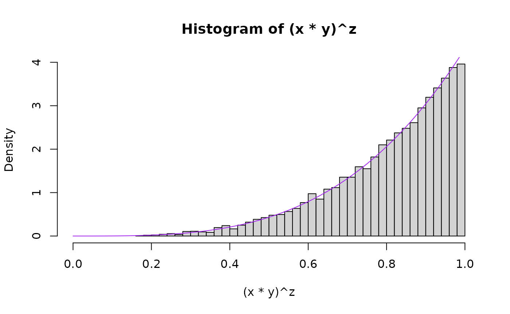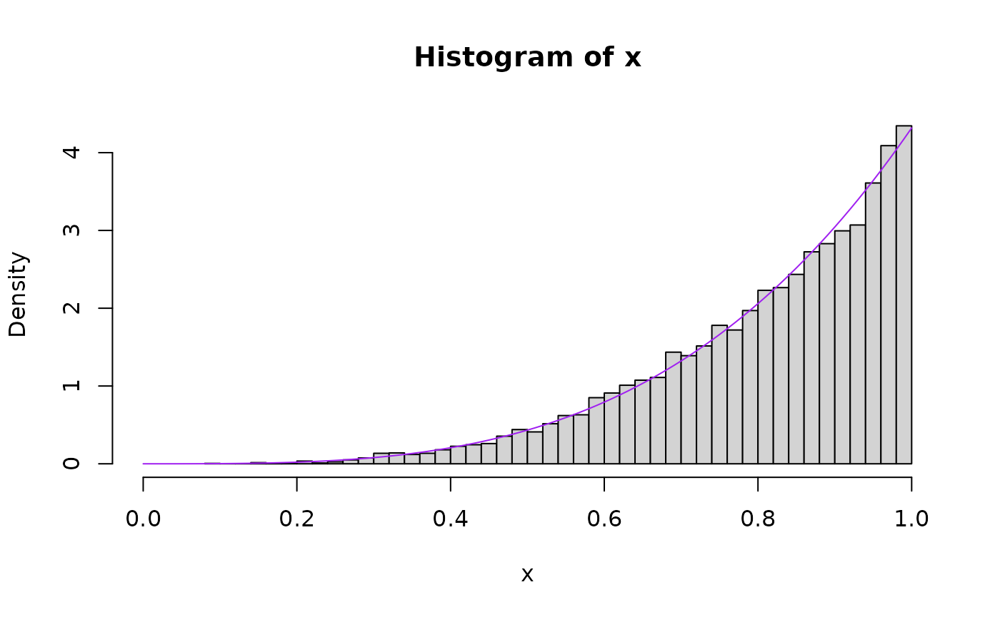

#### alpha = 4.318

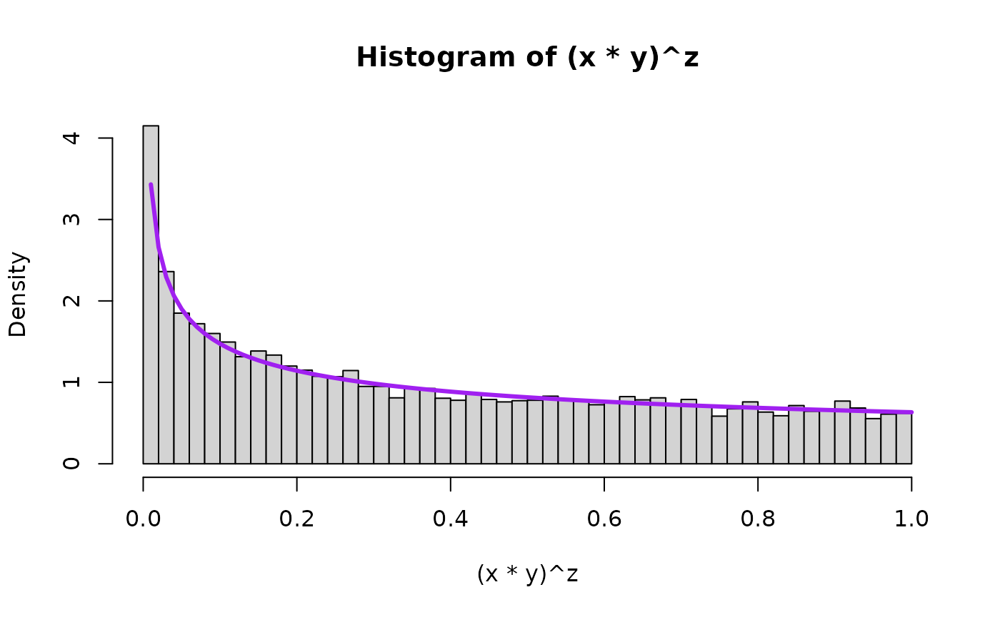

#### alpha = 0.633

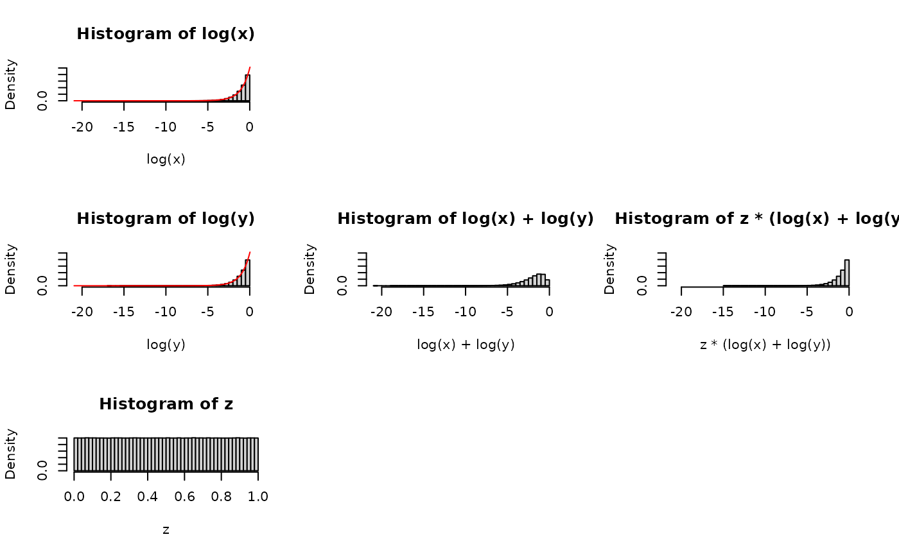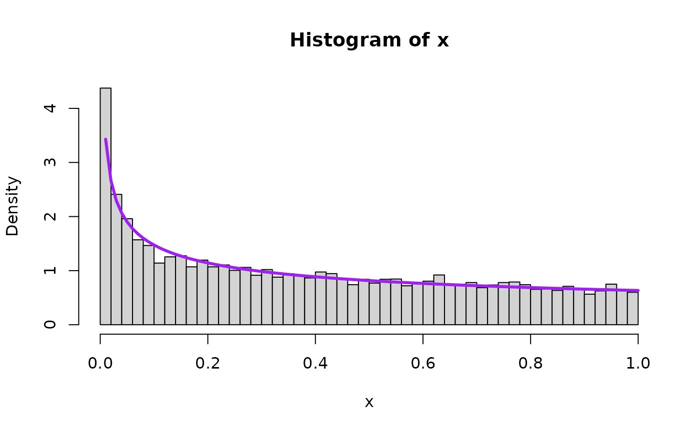

### Log-scale for intuition building

Consider the log scale, which changes the relation from a product raised
to a power into a sum multiplied by a number. In other words, a
convolution (sum of two random variables) and a scale mixture (then
multiplied by a random variable).

We will visualize this using 5 plots arranged in a 3x3 grid. The left
column will show the distributions of each of the 3 components of
consideration (log(X), log(Y), and Z), the middle column will just show
the convolution of log(X) and log(Y), that is to say log(X)+log(Y), and
the third one will show the scale mixture applied to the convolution. If
a line appears on top of the histogram, that’s the theoretical result,
and the bars falling nicely along the line shows agreement between the
simulation and the expected theoretical result.

Take a look at this for alpha=1:

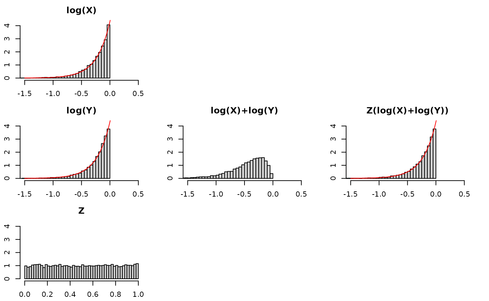

Quick observations –

- log(X): is a Reflected Exponential with rate $\alpha$, as is log(Y)
  *and* Z(log(X)+log(Y))!
  - the bars fall along the red density line
- log(X) + log(Y): the convolution (i.e., sum) of two Reflected
  Exponentials is more disperse and squattier than just one Reflected
  Exponential. We know this already – think of adding two normals
  together and the variance of the resultant Normal having the sum of
  the variances of the original normals.
  - the bars fall along a RefelectedGamma(2,$\alpha$) density
- Z(log(X)+log(Y)): to “recover” or “get back to” the original
  distribution before the convolution, log(X), we need to “tighten” or
  “gather” or “concentrate” the log(X)+log(Y) distribution. Multiplying
  it by a random number between 0 and 1 will do exactly that.

See for other values for alpha:

#### alpha = 4.318

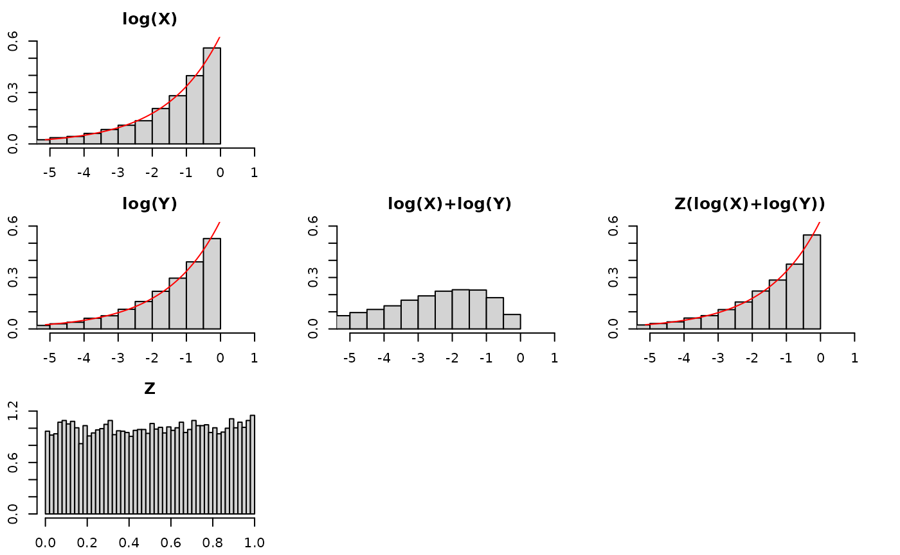

#### alpha = 0.633

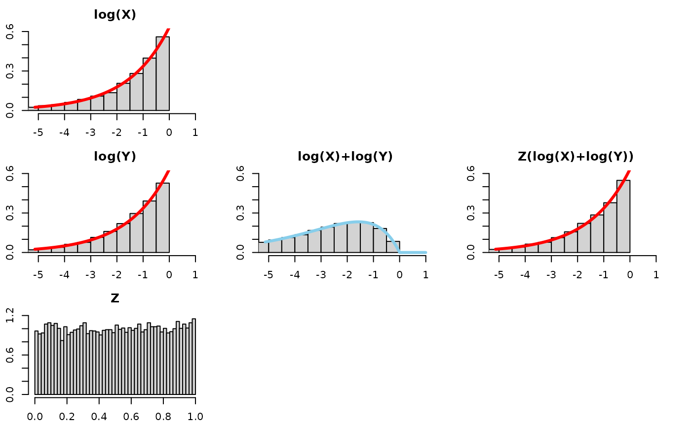

### Sanity check: Result 2

Now we draw a bunch of random beta and uniform random variables and then
plot the quantities to see the theory in action for
$\left( \frac{1}{XY} \right)^{Z} \sim$ Pareto(scale$= 1$,
shape$= \alpha$). We will plot the theoretical result in purple on top
of the histogram. First for $\alpha = 1$, the special uniform instance
(because that is what started it all for Result 1!) and $\alpha = 4.318$
as an arbitrary value bigger than 1 and $\alpha = 0.633$ as an arbitrary
value smaller than 1.

#### alpha = 1.000

``` r
set.seed(1)
nsims <- nsim.switch
aa_x <- 1
aa_y <- 1

x <- rbeta(nsims,aa_x,1) ##runif(nsims,0,1)
y <- rbeta(nsims,aa_y,1) ##runif(nsims,0,1)
z <- runif(nsims,0,1)

hist((1/x*1/y)^z, breaks=nsim.switch, freq=FALSE, xlim=c(0,15), ylim=c(0,1))

lines(               seq(0,100,0.01),
                     LNPar::dpareto(seq(0,100,0.01),1,alpha=aa_x),
                     type="l",
                     lwd=overlaid.dens.lwd,
                     col="purple"
)

hist(1/x, freq=FALSE, breaks=6e4, xlim=c(0,15), ylim=c(0,1))
lines(               seq(0,100,0.01),
                     LNPar::dpareto(seq(0,100,0.01),1,alpha=aa_x),
                     type="l",
                     lwd=overlaid.dens.lwd,
                     col="purple"
)

## compare mean, variance, and 2nd moment
prod <- (1/x*1/y)^z
mean(prod)
#> [1] 8.878238
var(prod)
#> [1] 4277.258
var(prod) + mean(prod)^2
#> [1] 4356.082


mean(1/x)
#> [1] 10.28434
var(1/x)
#> [1] 32794.94
var(1/x) + mean(1/x)^2
#> [1] 32900.71
```

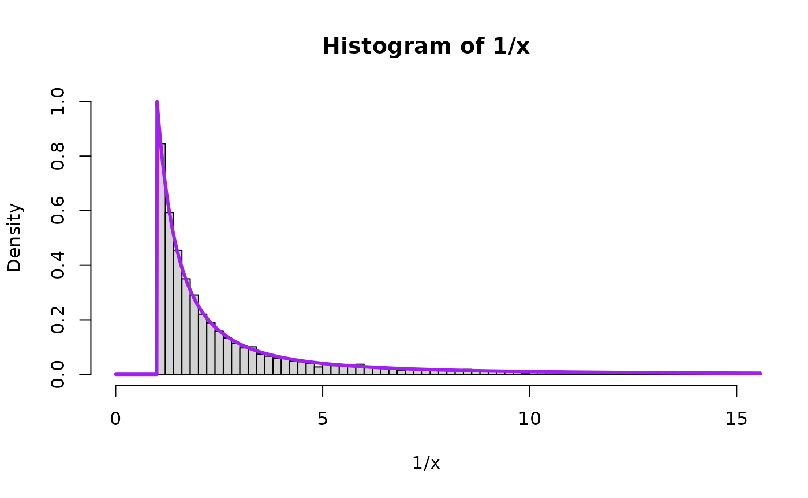

#### alpha = 4.318

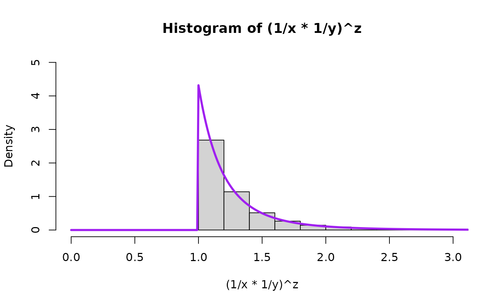

#### alpha = 0.633

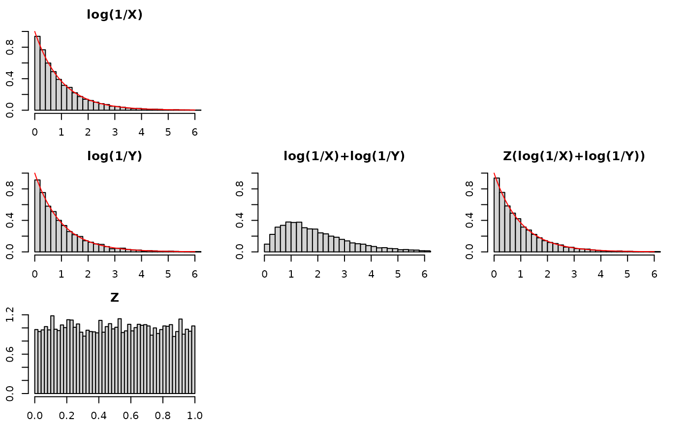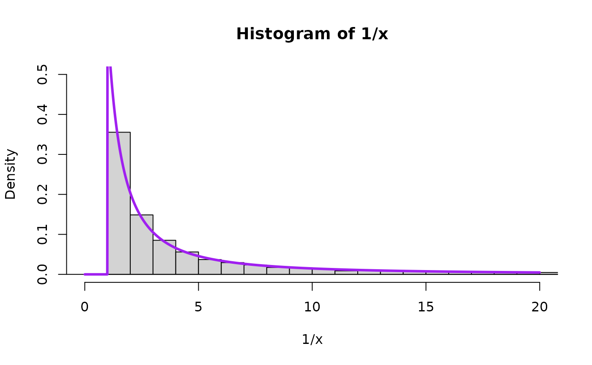

### Log-scale for intuition building

Consider the log scale, which changes the relation from a product raised
to a power into a sum multiplied by a number. In other words, a
convolution (sum of two random variables) and a scale mixture (then
multiplied by a random variable).

We will visualize this using 5 plots arranged in a 3x3 grid. The left
column will show the distributions of each of the 3 components of
consideration (log(X), log(Y), and Z), the middle column will just show
the convolution of log(X) and log(Y), that is to say log(X)+log(Y), and
the third one will show the scale mixture applied to the convolution.

Take a look at this for alpha=1:

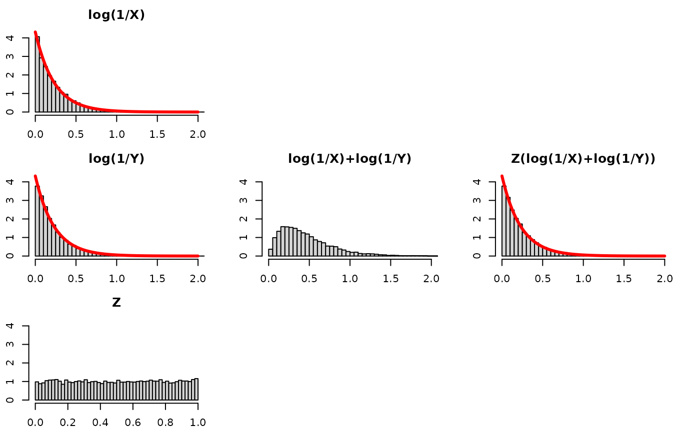

Quick observations –

- log(X): is an Exponential($\alpha$), as is log(Y) *and*
  Z(log(X)+log(Y))!
- log(X) + log(Y): the convolution (i.e., sum) of two Exponentials is
  more disperse and squattier. We know this already – think of adding
  two normals together and the variance of the resultant Normal having
  the sum of the variances of the original normals.
  - the bars fall along a Gamma(2,$\alpha$) density  
- Z(log(X)+log(Y)): to “recover” or “get back to” the original
  distribution before the convolution, log(X), we need to “tighten” or
  “gather” or “concentrate” the log(X)+log(Y) distribution. Multiplying
  it by a random number between 0 and 1 will do exactly that.

See for other values for alpha:

#### alpha = 4.318


#### alpha = 0.633

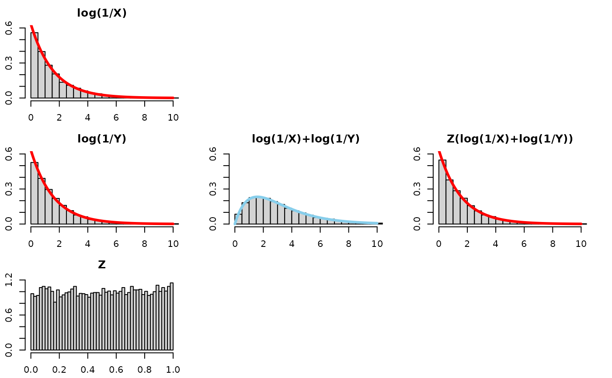

### Follow-up questions

Follow up questions means we can explore more. This was a top comment on
the response video linked in the intro:

> @JobBouwman 8 months ago Adding two exponentials will double the
> outcome. Then multiplying this with a random uniform scalar between 0
> and 1 will on average half the result.

This comment in addition to the video helped inspire this document. The
comment in particular inspired two questions of mine.

- Q: Why “1/2 on average” and not just “1/2 all the time with no
  variation”?

Let’s see what the resultant Z(log(1/X)+log(1/Y)) distribution would
look like if we replaced `z<-runif(nsims, 0, 1)` with
`z <- rep(1/2, nsims)` in the code. We will see it “concentrates” too
much and doesn’t recover the distribution of log(1/X) – the bars go well
above the red density line of the exponential:

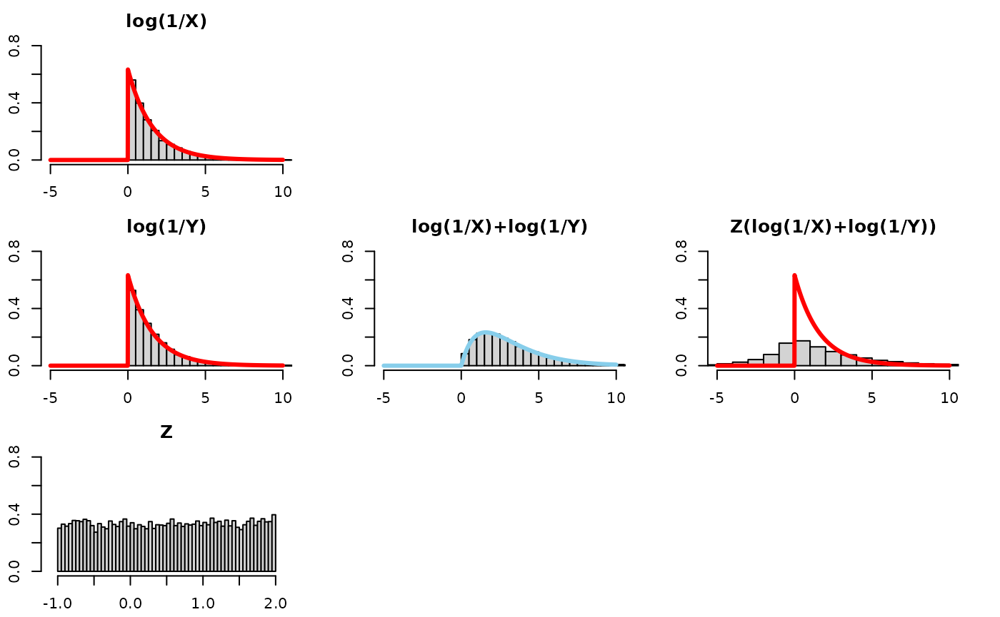

- Q: Ok, so Z has to be random. But can it be 1/2 on average but with
  bounds bigger than 0,1 ?

Let’s see what the resultant Z(log(1/X)+log(1/Y)) distribution would
look like if we replaced `z<-runif(nsims, 0, 1)` with
`z<-runif(nsims, -1, 2)` in the code. The mean of Z is 1/2. However, Z
is not bounded between 0 and 1. Hypothesis: even though this Z will “1/2
on average” it fails to recover the distribution log(1/X) because Z
values bigger than 1 fail to “tighten” the distribution. Compounding the
problem is that Z values below 0 (negative values) flip/reflect values
across the y-axis. See below:


------------------------------------------------------------------------

## Bonus: What about 3 exponentials?

We have already stated Results 1-K and 2-K which generalized things to
summing K exponentials. However, let’s build some intuition pretending
we did not have those results and just tried to add a 3rd variable to
the procedure we have been doing to this point.

Let’s see what the resultant Z(log(1/X)+log(1/Y)+log(1/A)) distribution
would look like, with X,Y,A as iid beta(0.633,1) and an independent Z
iid U(0,1)


It looks like we need more tightening from Z. Let’s tinker. Instead of
multiplying by 1/2 on average, perhaps we need to multiply by 1/3 on
average? Let’s leave Z as a uniform, with positive values smaller than 1
that average to a 1/3. Let’s replace `z<-runif(nsims, 0, 1)` with
`z<-runif(nsims, 0, 2/3)` in the code:

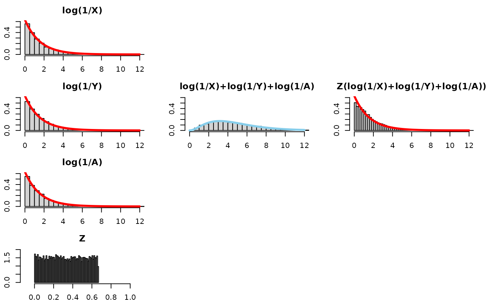

While that was fun, this modification (shortening the range of the
uniform) does not quite seem to “recover” the distribution of log(1/X).
It seems we needed more Z values that are smaller to fill in the part of
the density near 0.

There’s another way to get Z to be “1/3 on average”. That is, we could
draw two uniforms, V ~ uniform(0,1) and W ~ uniform(0,1) and let
Z=min(V,W) (This insight was shown by Dr. Mihai Nica’s [follow-up
video](https://www.youtube.com/watch?v=Zx5T_IrNhUE). ). Note, this is
the same as letting Z ~ beta(1,**3**-1). The **3** is bolded, because
this is the number of exponentials that are being summed. This gives us
a way to generalize to **K** exponentials being summed.

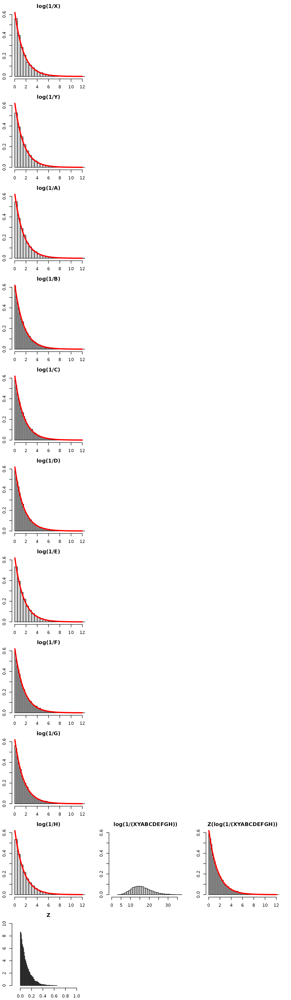

- nailed it!

Let’s try it for summing 10 exponentials.

This means we need Z to be “1/10 on average”. That is, we could draw 9
uniforms let Z be the minimum of those 9 uniforms. This is the same as
letting Z ~ beta(1,**10**-1). The **10** is bolded, because this is the
number of exponentials we’re summing, and it generalizes to any positive
integer.

Be mindful of the x-axis and y-axis limits – they are not the same for
every plot!


–\>

All of these simulations and results are for a common $\alpha$. We
consider the case unequal $\alpha$ case in [part II of this
topic](https://swihart.github.io/mvpd/articles/xy_to_the_z_part_ii.html).

#### Miscellany / Notes to self / Stubs for future ideas

- [Proof of -ln(X) being an
  Exponential](https://math.stackexchange.com/a/3173387/180716)

- [Is this transformation of beta relevant for a=0,
  b=1?](https://math.stackexchange.com/a/4039033/180716)

- [Keep in back pocket for generalizing
  Uniform…U(-1,1)](https://stats.stackexchange.com/a/461337/35034)

- Looking at the [inductive
  form](https://math.stackexchange.com/a/3485159/180716), may provide
  insight as to why Z may not have a “recovering” distribution for a sum
  of more than 2 exponentials.
