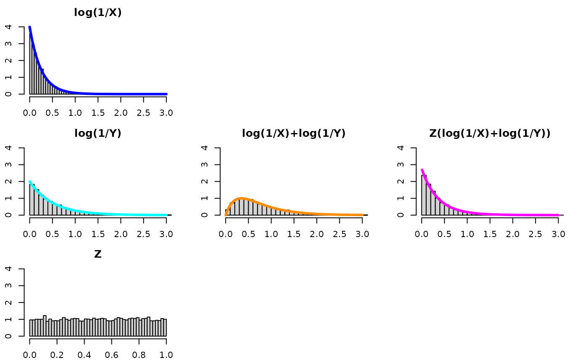
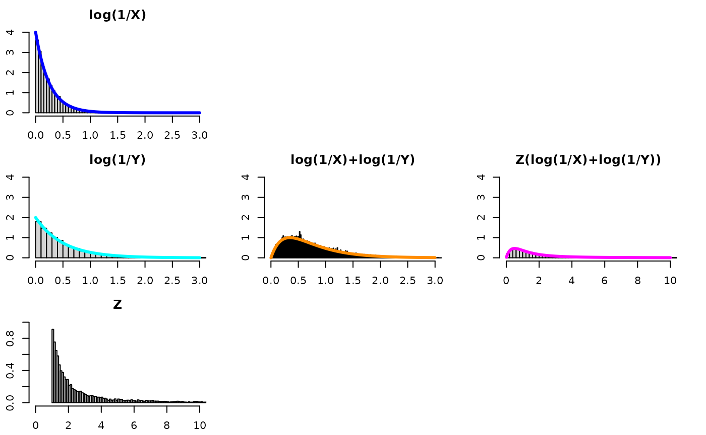
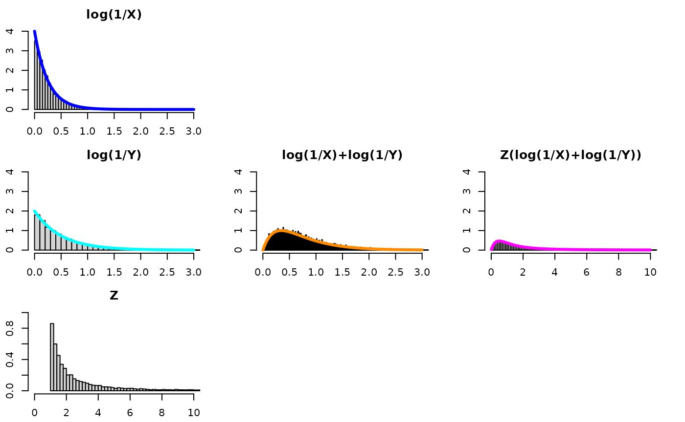
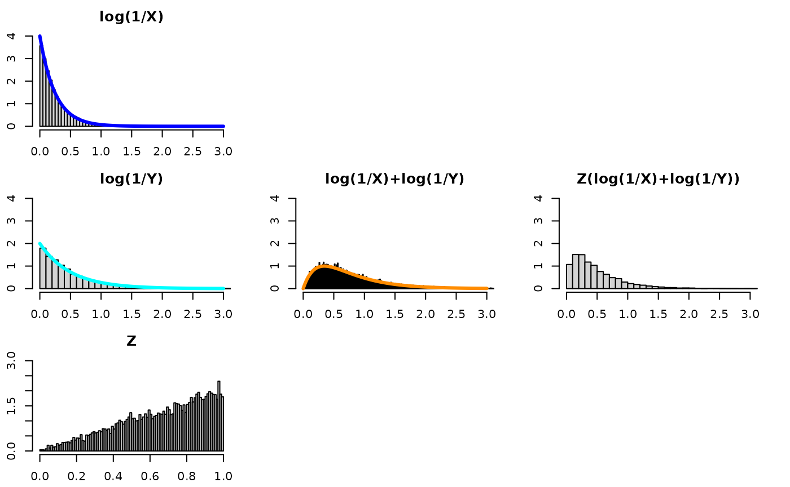

# (XY)^Z Part II

------------------------------------------------------------------------

**IN PROGRESS**

------------------------------------------------------------------------

First off, it is natural to see what would happen if we relaxed the
constraint of common rates. Second off, doing so will immediately ruin
the wow factor of the challenge problem. Think about it – if X is
beta($\alpha_{x}$,1) and Y is beta($\alpha_{y}$,1) then
Z(log($\frac{1}{XY}$)) cannot be both, simultaneously,
beta($\alpha_{x}$,1) and beta($\alpha_{y}$,1). Maybe there’s some cool
formula that shows the computed quantity to be a mix of the two, like
weights that involve $\alpha_{x}$ and $\alpha_{y}$ – but by definition,
X, Y, and $Z\left( log\left( \frac{1}{XY} \right) \right)$ cannot all
have the same distribution because X and Y have different distributions
– and that was part of the wow factor of the challenge problem in my
opinion.

## Two ways.

If we wanted to allow different rates, there are two ways to go about
it. One is to generalize the computed quantity in Result 1-K and 2-K.
This “seems obvious” given all the results in [part
I](https://swihart.github.io/mvpd/articles/xy_to_the_z_part_i.html).
That is, we raise each variable in the product to the rate of its
distribution and that basically makes Exp(1) variables on the log scale.
The other approach is to keep the computed quantity the same and see how
we can handle the different rates solely by investigating the
distribution of Z for Result 1 and 2 (I don’t try the general K case).
We look at each of these in the following sections.

## Way 1: Generalize The Computed Quantities

If

- $X_{1}$ ~ Beta($\alpha_{1}$, 1)

- $X_{2}$ ~ Beta($\alpha_{2}$, 1)

- …

- $X_{K}$ ~ Beta($\alpha_{K}$, 1)

- $Z$ ~ Beta(1, K-1)

Then

- $\left( X_{1}^{\alpha_{1}}X_{2}^{\alpha_{2}}\ldots X_{K}^{\alpha_{K}} \right)^{Z}$
  ~ Beta(1, 1)

Turns out there is another computed quantity with a distribution:

- $\left( \frac{1}{X_{1}^{\alpha_{1}}X_{2}^{\alpha_{2}}\ldots X_{K}^{\alpha_{K}}} \right)^{Z}$
  ~ Pareto(scale = 1, shape=1)

Let’s try it for summing 10 exponentials with different rates… and look
at this new computed quantity.

This means we need Z to be “1/10 on average”. That is, we could draw 9
uniforms let Z be the minimum of those 9 uniforms. This is the same as
letting Z ~ beta(1,**10**-1). The **10** is bolded, because this is the
number of exponentials we’re summing, and it generalizes to any positive
integer.

Be mindful of the x-axis and y-axis limits – they are not the same for
every plot!

What if we did not change the computed quantity and kept it without any
$\alpha$s as in [part
I](https://swihart.github.io/mvpd/articles/xy_to_the_z_part_i.html)?
That’s the topic of the next session.

## Way 2: Keep the Generalized Quantity – Investigate Z

In [part
I](https://swihart.github.io/mvpd/articles/xy_to_the_z_part_i.html) we
considered cases where the alpha for X and Y are the same and how
multiplying (log(1/X)+log(1/Y)) by Z allows one to recover the original
distribution of log(1/X) (equivalently, log(1/Y)). However, if
$\alpha_{x} \neq \alpha_{y}$, multiplying (log(1/X)+log(1/Y)) by a
uniform would not recover the distribution for either log(1/X) or
log(1/Y) – it would be a distribution “in-between” those two
distributions – but not an Exponential with an alpha between
$\alpha_{x}$ and $\alpha_{y}$. We consider this “unequal alpha” as a
bonus case below.

### What is the sum in the unequal rate case?

Firstly, one may want to consult Wikipedia.

- [Wikipedia Sum of Two Independent Exponential Random
  Variables](https://en.wikipedia.org/wiki/Exponential_distribution#Sum_of_two_independent_exponential_random_variables)

So, in this setup, there is no *one* distribution to recover since
$\alpha_{x} \neq \alpha_{y}$, so trying different distributions for $Z$
leads to different blends of the X,Y distributions for the quantity
Z(log(1/X)+log(1/Y)).

### Z distributed as U(0,1)

- $Z \sim$ U(0,1)
- magenta density
  - $f_{w}(w) = - \frac{mn\left( \Gamma(0,mw) - \Gamma(0,nw) \right)}{m - n}$
    where $W = Z\left( \log\frac{1}{X} + \log\frac{1}{Y} \right)$,
    m=$\alpha_{x}$, n=$\alpha_{y}$
  - $\Gamma(.,.)$ is [incomplete Gamma
    function](https://en.wikipedia.org/wiki/Incomplete_gamma_function#Special_values).

- While the computed quantity is not exponential, one can see it is a
  concentration of the convolution and that it is kind of “in-between”
  the two component distributions.

### Z distributed as Inverse-Gamma(alpha, beta)

- $Z \sim$ Inverse-Gamma($\alpha_{z}$, $\beta_{z}$)

- gold density

  - $f_{w}(w) = \frac{mn}{n - m}\frac{\beta_{z}^{\alpha_{z}}\Gamma\left( \alpha_{z} + 1 \right)}{\Gamma\left( \alpha_{z} \right)}\left( \frac{1}{\left( mw + \beta_{z} \right)^{\alpha_{z} + 1}} - \frac{1}{\left( nw + \beta_{z} \right)^{\alpha_{z} + 1}} \right)$
    where $W = Z\left( \log\frac{1}{X} + \log\frac{1}{Y} \right)$,
    m=$\alpha_{x}$, n=$\alpha_{y}$.

- While the computed quantity is not exponential, one can see it is a
  concentration of the convolution and that it is kind of “in-between”
  the two component distributions.

### Z distributed as Pareto

- $Z \sim$ Pareto($x_{m} = 1$,$\alpha_{m} = 1$) (where 1/Z ~ U(0,1))

- magenta density:

  - $f_{w}(w) = \frac{n^{2}\left( 1 - \exp^{- mw}(1 + mw) \right) - m^{2}\left( 1 - \exp^{- nw}(1 + nw) \right)}{mn(n - m)w^{2}}$
    where $W = Z\left( \log\frac{1}{X} + \log\frac{1}{Y} \right)$,
    m=$\alpha_{x}$, n=$\alpha_{y}$.

- What is the opposite of “concentration” – bleeding out? Multiplying
  the convolution by a random number bigger than 1 disperses it.

### Z distributed as ????

