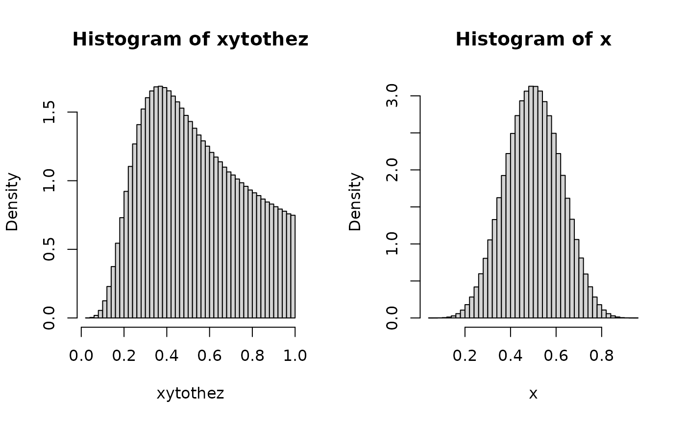
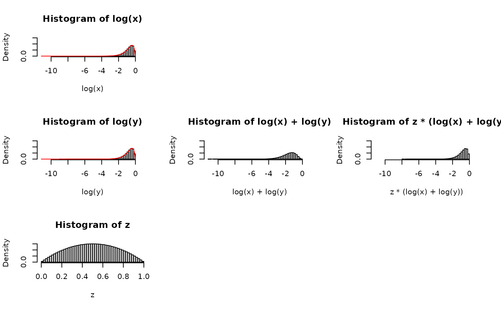
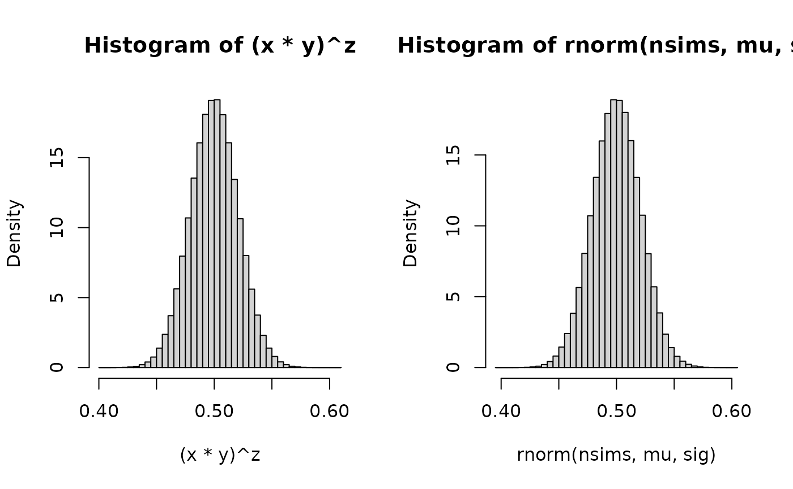

# (XY)^Z Part III

------------------------------------------------------------------------

**IN PROGRESS**

------------------------------------------------------------------------

I’m about 8 months late to the party, but a challenge problem from
3blue1brown caught my attention, as well as a call for intuitive
approaches.

> Here’s the challenge mode for all you math whizzes. Sample three
> numbers x, y, z uniformly at random in \[0, 1\], and compute (xy)^z.
> What distribution describes this result?
>
> Answer: It’s uniform!
>
> I know how to prove it, but haven’t yet found the “aha” style
> explanation where it feels expected or visualizable. If any of you
> have one, please send it my way and I’ll strongly consider making a
> video on it.
>
> – Grant Sanderson of 3blue1brown, 2024-09-10

## Beta, Beta, Beta

In Part I, we kept Z as a U(0,1). This is because initially I swung for
the fences, investigating generalizing the original problem of X,Y,Z
being all uniform to X,Y,Z being all beta and got some tantalizing
results but I could not quite bring it to fruition. Below is the stub of
code and I’ll write it up later.

Browser tabs that were useful on the search:

- [Math SE post from
  2012](https://math.stackexchange.com/q/261783/180716).

- [product of two
  betas](https://math.stackexchange.com/q/1073364/180716)

- [moment matching techinque (applied to product of
  betas)](https://math.stackexchange.com/a/2440749/180716)

- [and using mathematica (check your
  files)](https://math.stackexchange.com/a/2441409/180716)

  - which could lead to [mathstatica](http://www.mathstatica.com/) as
    reviewed [here](http://www.jstatsoft.org/v47/s01/paper)
  - and/or [Rubi](https://rulebasedintegration.org/downloadRubi.html)
  - which led to reading about
    [2F1()](https://en.wikipedia.org/wiki/Hypergeometric_function#Integral_formulas)

``` r

nsims <- 1e7
aa <- 8#2#1#8.5
bb <- 8#2#1#8.5
x <- rbeta(nsims, aa, bb)
y <- rbeta(nsims, aa, bb)
z <- rbeta(nsims, 1, 2-1)

cor(x  ,y  )
#> [1] -0.0002956492
cor(x^z,y^z) ## bc z is random
#> [1] 0.7346134
cor(x^19, y^19)
#> [1] 0.0006771847

xytothez <- (x*y)^z


par(mfrow=c(1,2))
hist(xytothez, freq=FALSE, breaks=50)
mean(xytothez)
#> [1] 0.5357581
var(xytothez)
#> [1] 0.05108758
var(xytothez) + mean(xytothez)^2
#> [1] 0.3381244

hist(x, freq=FALSE, breaks=50)
```



``` r
mean(x)
#> [1] 0.5000299
var(x)
#> [1] 0.01470367
var(x) + mean(x)^2
#> [1] 0.2647336

moment_integrand <- function(x, k, a, b){
  
  #beta(a + x*k, b) / beta(a,b) * dbeta(x, a, b)
  
  beta(a + x*k, b) / beta(a,b) * 
  beta(a + x*k, b) / beta(a,b) * 
                     dbeta(x, a, b)
  
  
}

mom2 <- as.numeric(
  integrate(moment_integrand,
            lower=0,
            upper=1,
            k=2, a=aa, b=bb)[1])
mom2
#> [1] 0.2642006
#var(x^z) + mean(x^z)^2
var(xytothez) + mean(xytothez)^2
#> [1] 0.3381244
beta(aa + 2, bb) / beta(aa,bb)
#> [1] 0.2647059


mom1 <- as.numeric(
  integrate(moment_integrand,
            lower=0,
            upper=1,
            k=1, a=aa, b=bb)[1])
mom1
#> [1] 0.4997182
#mean(x^z)
mean(xytothez)
#> [1] 0.5357581
beta(aa + 1, bb) / beta(aa,bb)
#> [1] 0.5


## effort into getting standardized axes for the quantities involved

s.xlim <- range(c(log(x),
                      log(y),
                      z,
                      log(x*y),
                      z*log(x*y)
)
) #c(-10,0)#c(-4,2)

s.ylim <- c(0, max(dbeta(seq(s.xlim[1],s.xlim[2],0.01), aa, bb)))
s.ylim
#> [1] 0.000000 3.142034
s.xlim
#> [1] -4.219205  1.000000

dlogbeta<-function(x,a,b) exp(a*x) * (1-exp(x))^(b-1) / beta(a,b)

par(mfcol=c(3,3))
hist(log(x), freq=FALSE, breaks=50, ylim=s.ylim, xlim=s.xlim)
lines(seq(s.xlim[1], s.xlim[2],0.01 ),
      dlogbeta(seq(s.xlim[1], s.xlim[2],0.01 ),
               aa,
               bb),
      col="red"
)

hist(log(y), freq=FALSE, breaks=50, ylim=s.ylim, xlim=s.xlim)
lines(seq(s.xlim[1], s.xlim[2],0.01 ),
      dlogbeta(seq(s.xlim[1], s.xlim[2],0.01 ),
               aa,
               bb),
      col="red"
)

hist(    z , freq=FALSE, breaks=50, ylim=s.ylim, xlim=c(0,1))


plot(NA,NA,axes=F,xlim=c(0,1),ylim=c(0,1),xlab="",ylab="")
hist(log(x)+log(y), freq=FALSE, breaks=50, ylim=s.ylim, xlim=s.xlim)
plot(NA,NA,axes=F,xlim=c(0,1),ylim=c(0,1),xlab="",ylab="")

plot(NA,NA,axes=F,xlim=c(0,1),ylim=c(0,1),xlab="",ylab="")
hist(z*(log(x)+log(y)), freq=FALSE, breaks=50, ylim=s.ylim, xlim=s.xlim)
# lines(seq(s.xlim[1], s.xlim[2],0.01 ),
#       dlogbeta(seq(s.xlim[1], s.xlim[2],0.01 ),
#                aa,
#                bb),
#       col="red"
# )

plot(NA,NA,axes=F,xlim=c(0,1),ylim=c(0,1),xlab="",ylab="")
```



``` r


mean(   log(x)        ) 
#> [1] -0.7252979
digamma(aa) - digamma(aa+bb)
#> [1] -0.7253719
mean(z*(log(x)+log(y)))
#> [1] -0.7249533

var (   log(x)        ) 
#> [1] 0.06860578
trigamma(aa) - trigamma(aa+bb)
#> [1] 0.06864323
var (z*(log(x)+log(y)) )
#> [1] 0.2210332


## attempts at new relations:
## attempts at new relations:
## attempts at new relations:

con <- 1.0055
var (z^con * con * (log(x)+log(y)))
#> [1] 0.2236243
mean (z^con * con * (log(x)+log(y)))
#> [1] -0.7269401

con2 <- 0.0325
var (z*(log(x)+log(y) - con2 ))
#> [1] 0.228978
mean(z*(log(x)+log(y) - con2 ))
#> [1] -0.7411953

var (z*(log(x)+log(y)+ (log(x)*log(y))  ) )
#> [1] 0.07624856
```

## Normal Approximation

- So if we get a result generalizing to betas, interesting to note the
  [normal approximation for
  betas](https://en.wikipedia.org/wiki/Beta_distribution#Normal_approximation_to_the_Beta_distribution)

``` r
nsims <- 1e6
## https://en.wikipedia.org/wiki/Beta_distribution#Normal_approximation_to_the_Beta_distribution
aa<-bb<-5.5
mu <- 0.5
sig <- (1/(4*(2*aa+1)))
x <- rnorm(nsims, mu, sig)
y <- rnorm(nsims, mu, sig)
z <- rnorm(nsims, mu, sig)

par(mfrow=c(1,2))
hist((x*y)^z, freq=FALSE, breaks=50)
mean((x*y)^z)
#> [1] 0.4999955
var((x*y)^z)
#> [1] 0.0004262521
hist(rnorm(nsims, mu,sig), freq=FALSE, breaks=50)
```



``` r
mean(rnorm(nsims, mu,sig))
#> [1] 0.5000197
var(rnorm(nsims, mu,sig))
#> [1] 0.0004339315
```
